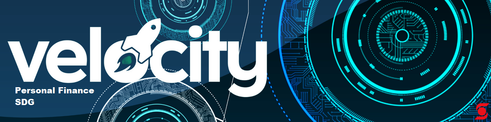

# Welcome to the `Personal Finance SDG` Repo!

## Objective

This page will be a hub for any material our Velocity peers come across or create that they deem valuable and shareable

## Usage

1. Clone repo and create a new branch: $ git checkout https://github.com/gmandl10/Personal-Finance-SDG -b name_for_new_branch
    + You can also download documents individually if you wish!
2. Indulge in all the finance material contained within
3. If you wish to contribute, submit pull requests and let us know what you've added and why!
    + Or we can add it on your behalf!

## Organization

1. Sessionals
    + Material created and delivered by the Personal Finance SDG team during tutorials and analysis
3. Articles
    + News or opinion pieces published by reputable sources or authorities in the finance/economics domain
4. Books
    + Textbooks or non-fiction works that covers finance or economic material
5. Websites
    + Websites that contains tools, news, or other useful material
6. Software
    + Source code developed by velocity students that they would like to share
---

# **Happy learning!!!**

